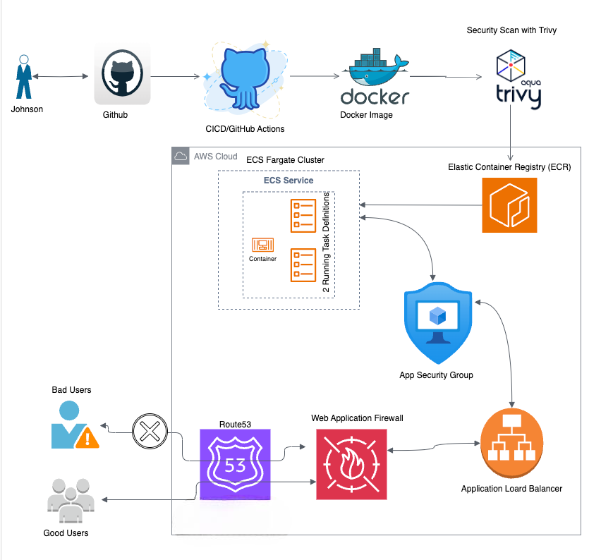
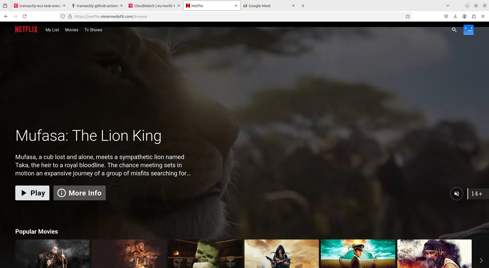
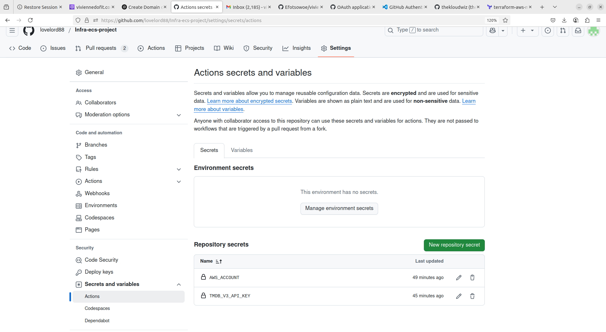
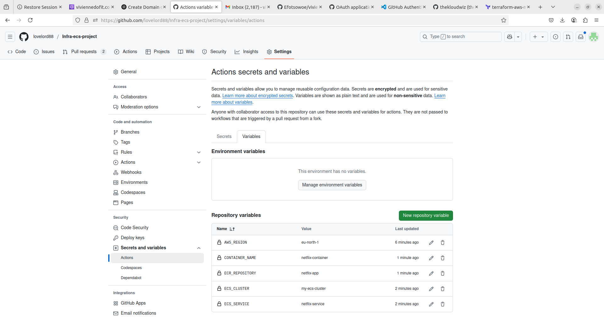
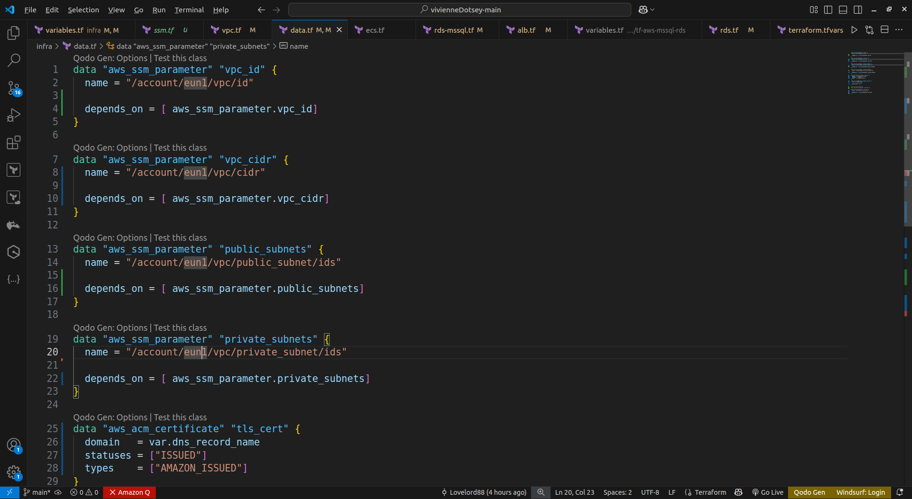
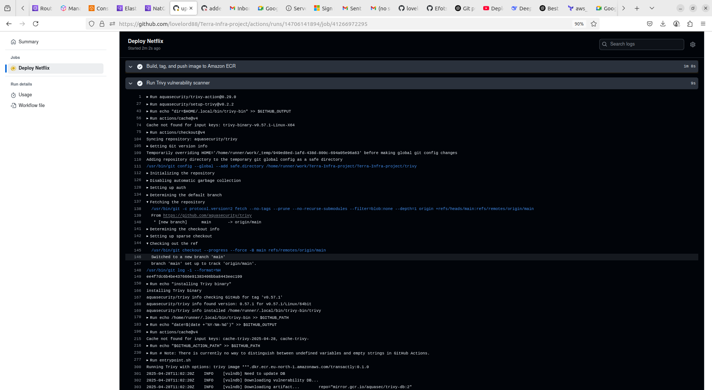
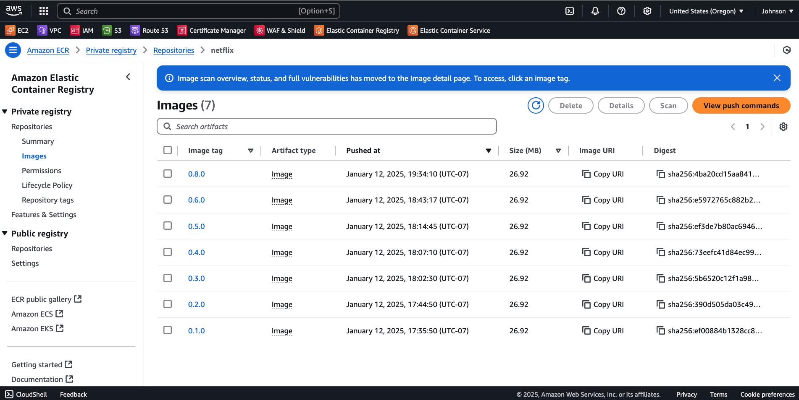
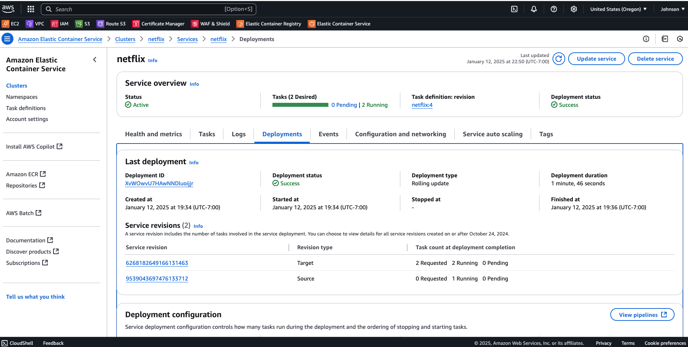
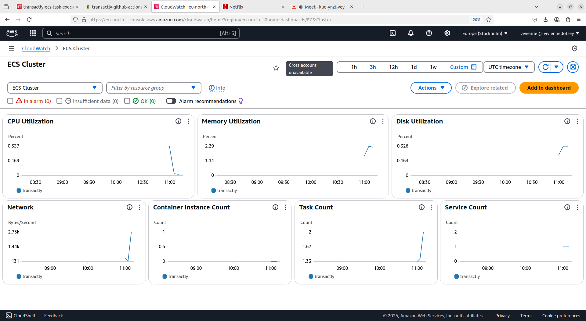
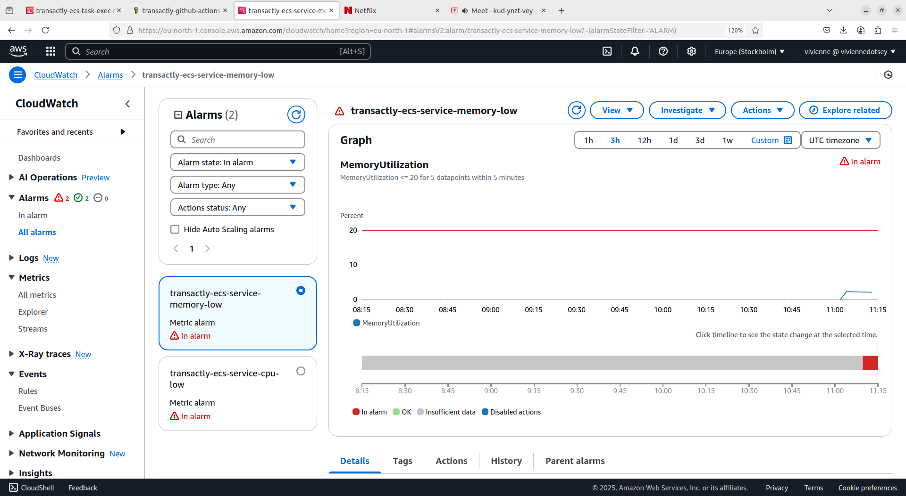

# Declaration
This project was done by **Vivienne Dotsey** for the **Take Home Assignment** given by **Transactly** by **Nsano**.  
If you chance on this project and you use it and love it, feel free to reach out to me on **LinkedIn** and give me a shout so we can connect!

---

### 🚀 Benefits of Using Terraform

- **Infrastructure as Code**: Easily define, provision, and manage infrastructure using simple configuration files.
- **Version Control**: Track and manage infrastructure changes alongside your application code.
- **Automation**: Reduce manual work with automated deployments and updates.
- **Multi-Cloud Support**: Manage resources across AWS, Azure, GCP, and more with a single tool.
- **Consistency**: Ensure predictable and repeatable infrastructure setups.

---


## Architecture Diagram

Below is a high-level view  of the AWS infrastructure and CI/CD process. It includes the GitHub Actions pipelines (`app.yml` and `infra.yml`), the Terraform-managed AWS infrastructure, and the final deployment to ECS with an ALB and AWS WAF:

---

## Architecture Diagram:



---

## Deployed Application

To access the deployed application, please visit the URL:  
**https://netflix.viviennedofit.com/**



---

# Mapping Features and Controls in this Project to SOC 2 Requirements

This document provides an overview of how the **CI/CD pipeline**, **Infrastructure as Code (IaC)**, **AWS WAF configuration**, and **Container Scanning** address key SOC 2 controls. Each feature or control is mapped to the **relevant SOC 2 Trust Services Criteria (TSC)** (often referred to as **CC** for Common Criteria).

---

## Handling of Secrets and Environment Variables
Sensitive data and configuration values are managed securely throughout the setup:

- **GitHub Secrets & Variables**:  
  - Sensitive information such as AWS account ID, API keys, and other credentials are stored in GitHub Secrets.  



  - Configuration parameters like `aws_region`, `container_name`, `ecr_repository`, `ecs_cluster_name`, and `ecs_service_name` are managed as GitHub variables.



- These practices ensure that sensitive data is not hardcoded in code, reducing exposure risk.

- **AWS SSM Parameter Store**:  
  - Within the infrastructure setup (Terraform code), sensitive data—such as VPC IDs, subnet IDs, TLS certificate ARNs, etc.—are retrieved from AWS Systems Manager (SSM) Parameter Store. 



  - This avoids hardcoding sensitive information in infrastructure code, promoting secure and maintainable practices.

**SOC 2 Control Alignment**:
- **CC6.1 – CC6.3 (Logical Access & Data Protection)**: Secure handling of secrets ensures that sensitive data is only accessible to authorized processes and individuals.
- **CC6.6 (Encryption & Key Management)**: Data is protected in transit and at rest through secure storage mechanisms like GitHub Secrets and AWS SSM Parameter Store.

---

## 1. CI/CD Pipeline (GitHub Actions)

The GitHub Actions workflows (`app.yml` and `infra.yml`) automate builds, vulnerability scanning (via **Trivy** in `app.yml`), and deployments to AWS ECS.

### 1.1 Build & Versioning
- **Description**: The workflow checks out code, bumps application version tags, and builds Docker images. Tags are auto-generated for each release.  
- **SOC 2 Control Alignment**:  
  - **CC7.4** (System Operations – Secure Deployment): Ensures a consistent and secure process for building images and releasing to production.  
  - **CC8.1** (Change Management): The versioning step provides traceability for every change.

### 1.2 Container Scanning (Trivy)
- **Description**: Images are scanned for vulnerabilities (CVEs) before pushing to ECR, blocking builds with **high-severity** findings. Scanning ensures timely identification of known security issues before images are pushed to the repository. Automated checks reduce the risk of deploying vulnerable images.
  ```yaml
  - name: Run Trivy vulnerability scanner
    uses: aquasecurity/trivy-action@0.28.0
    with:
      image-ref: ${{ steps.build-image.outputs.image }}
      format: 'table'
      exit-code: '1'
      ignore-unfixed: true
      vuln-type: 'os,library'
      severity: 'HIGH'


**SOC 2 Control Alignment**:
- **CC7.1 (Detecting Vulnerabilities)**: Scanning ensures timely identification of known security issues.
- **CC7.2 (Monitoring Software)**: Automated checks reduce the risk of deploying vulnerable images.

### 1.3 Artifact Logging & Reporting
**Description**: Scan results are surfaced in GitHub Actions logs, providing an auditable trail if vulnerabilities are found or ignored.

**SOC 2 Control Alignment**:
- **CC7.3 (Responding to Issues)**: The logs support incident review, remediation tracking, and auditor evidence.
- **CC3.2 / CC4.1 (Risk Assessment & Monitoring)**: Formal record-keeping of security scans aids in continuous risk monitoring.

### 1.3 ECR Push & ECS Deployment
**Description**: After a successful scan, the image is pushed to Amazon ECR, and the ECS service is updated with the new task definition.

<!-- 

 -->

## Amazon ECS Automatic Dashboard Monitoring  

## Overview  
Amazon ECS integrates with CloudWatch to auto-generate dashboards for monitoring applications. These provide real-time metrics (CPU, memory, disk, network) without manual setup.  

## How It Works  
1. **Container Insights**:  
   - Enabled in ECS to auto-collect metrics (CPU, memory, disk I/O, network).  
2. **Service-Linked Role**:  
   - ECS creates `AWSServiceRoleForECS` to publish metrics to CloudWatch.  
3. **Auto-Generated Dashboards**:  
   - Named `ECS-ClusterName-ContainerInsights`.  
   - Shows: CPU/memory usage, network stats, task counts, and trends.  
4. **Logs**: Collected if logging drivers (e.g., `awslogs`) are enabled.  

## Customization  
- **Clone & Edit**: Modify the auto-generated dashboard.  
- **Alarms**: Set thresholds (e.g., high CPU) with SNS notifications.  

## Key Metrics  
| Metric              | Description                          |  
|---------------------|--------------------------------------|  
| `CPUUtilization`    | CPU usage by tasks (%)               |  
| `MemoryUtilization` | Memory usage by tasks (%)            |  
| `NetworkBytesIn`    | Incoming network traffic             |  
| `RunningTaskCount`  | Number of active tasks               |  

## Conclusion  
Container Insights automates ECS monitoring in CloudWatch. Extend with AWS X-Ray or OpenTelemetry for advanced use cases.  

 

 

**SOC 2 Control Alignment**:
- **CC8.1 (Change Management)**: Only authorized, fully scanned images are deployed.
- **CC6.1 – CC6.3 (Logical Access)**: OIDC-based AWS credentials control who can push images and assume roles.

---

## 2. Infrastructure as Code (Terraform)

All AWS infrastructure resources—ECR, ECS, ALB, WAF, Security Groups, Auto-Scaling, etc.—are defined and managed in Terraform.

### 2.1 Version-Controlled Terraform Repo
**Description**: The `infra.yml` workflow initializes, plans, and applies Terraform changes.

**SOC 2 Control Alignment**:
- **CC8.1 (Change Management)**: Infrastructure changes go through a controlled pipeline with review and logging.
- **CC9.2 (Risk Mitigation – in some frameworks)**: Ensures changes can be rolled back or audited for security impact.

### 2.2 AWS ECS Cluster and Services
**Description**: Fargate-based services, plus auto-scaling policies for CPU and memory thresholds.

**SOC 2 Control Alignment**:
- **CC7.2 (Monitoring Infrastructure)**: Auto-scaling monitors resource usage, mitigating performance-related security risks (e.g., potential DoS).
- **CC7.4 (Secure System Operations)**: Minimal manual intervention, reducing risk of misconfiguration.

### 2.3 Security Groups and IAM Roles
**Description**: Fine-grained security group rules restricting inbound traffic to ALB → ECS, and IAM roles (e.g., ECS task roles, OIDC roles).

**SOC 2 Control Alignment**:
- **CC6.1 – CC6.3 (Logical Access)**: Implements least-privilege approach for ECS tasks, container registry, and pipeline.
- **CC7.2 (Continuous Monitoring)**: Terraform state and CloudTrail logs can detect or alert on unauthorized modifications.

### 2.4 Lifecycle Policies & ECR
**Description**: ECR policies limit old image versions to keep 10 recent images.

**SOC 2 Control Alignment**:
- **CC7.2**: Removing stale images reduces attack surface for older unpatched versions.
- **CC7.3**: Simplifies remediation—teams focus on fewer, actively managed images.

---

## 3. AWS WAF Configuration

An AWS WAF is placed in front of the ALB to block malicious traffic and log suspicious activities to CloudWatch.

### 3.1 Managed Rule Groups & Rate Limiting
**Description**: AWS-managed rule sets block known bad inputs, suspicious IPs, or high request rates.

**SOC 2 Control Alignment**:
- **CC6.1 – CC6.3**: Restrict undesired traffic at the perimeter.
- **CC7.2**: Automated detection of abnormal traffic patterns (e.g., DDoS).

### 3.2 Centralized Logging
**Description**: WAF logs are ingested by CloudWatch, enabling real-time monitoring and alerting on suspicious requests.

**SOC 2 Control Alignment**:
- **CC7.3 (Responding to Issues)**: Logs offer forensics and incident response insights.
- **CC4.1 (Monitoring Activities)**: Continuous visibility into application-layer events.

### 3.3 Terraform-Based WAF Management
**Description**: WAF rules, logging, ACL associations, and priority are all version-controlled in `.tf` files.

**SOC 2 Control Alignment**:
- **CC8.1 (Change Management)**: Updates to WAF rules require code changes and approvals.
- **CC7.4 (System Operations)**: Ensures consistency and reproducibility of security policies.

---

## 4. Summary of SOC 2 Alignment

Below is a concise table connecting the major features to the relevant SOC 2 criteria:

| **Control (CC)**    | **Implementation Evidence**                                                                                                       |
|---------------------|-----------------------------------------------------------------------------------------------------------------------------------|
| **CC6.1 – CC6.3**   | OIDC for secure AWS authentication, IAM roles with least privilege, Security Groups restricting traffic, WAF blocking malicious IPs. |
| **CC6.6**           | TLS termination at ALB for encryption in transit.                                                                                 |
| **CC7.1**           | Container image scanning (Trivy) identifies known vulnerabilities before deployment.                                               |
| **CC7.2**           | Continuous monitoring of infrastructure (auto-scaling), WAF logs, pipeline gating on vulnerability thresholds.                     |
| **CC7.3**           | Logging in CloudWatch & GitHub Actions artifacts for vulnerability findings and incident investigation.                            |
| **CC7.4**           | Automated, secure deployments via GitHub Actions reduce risk of misconfigurations.                                                 |
| **CC8.1 (CC9.2)**   | Change management and version-control for Terraform resources, requiring reviews & approvals prior to merge/deploy.               |

By integrating these practices—**container vulnerability scanning**, **IaC workflows**, **AWS WAF protection**, and **detailed logging**—this project aligns with core SOC 2 Security controls, reflecting a mature DevSecOps approach.
